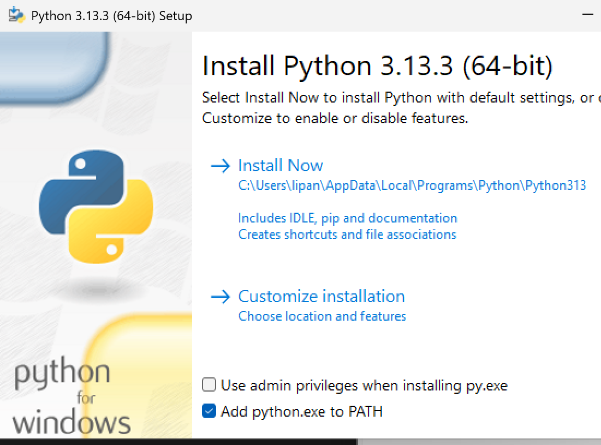
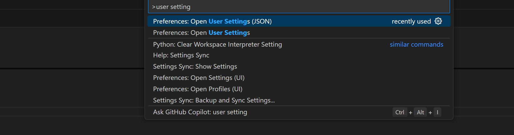
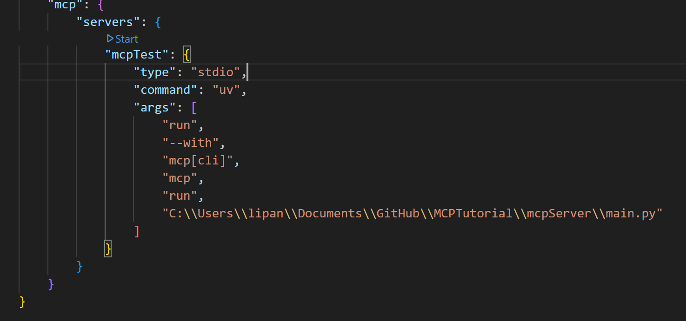
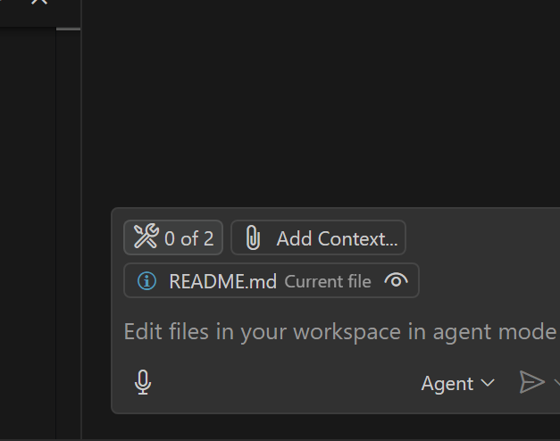
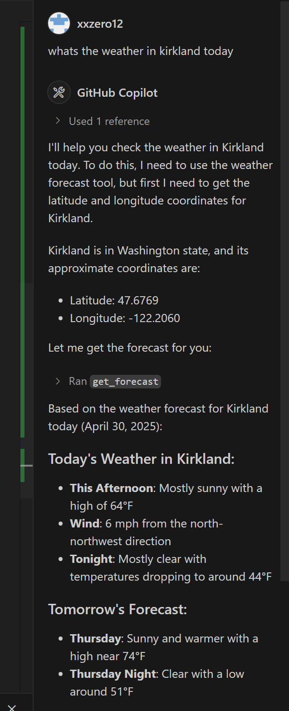
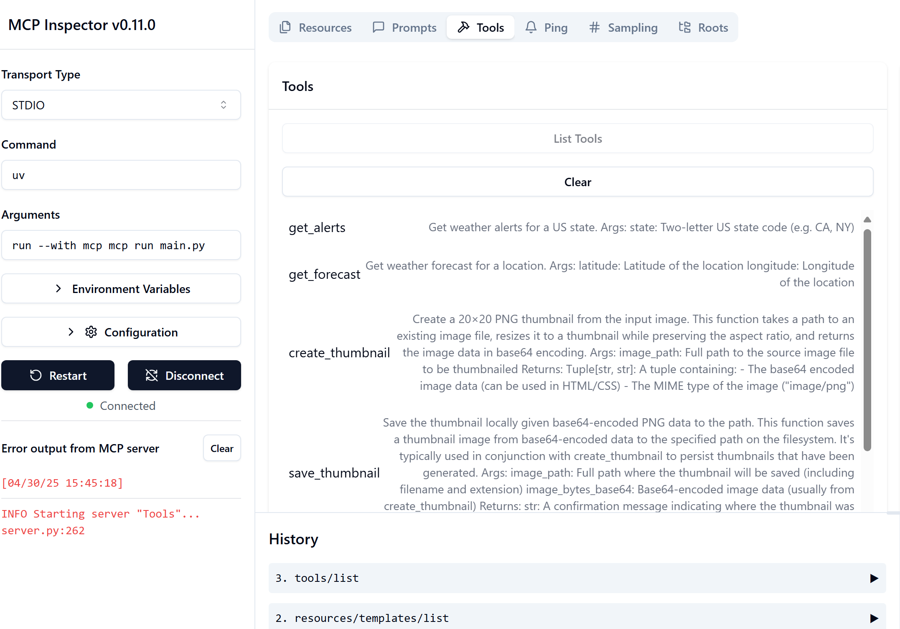

# MCPTutorial
### Prerequisite

Please clone the repo on local

##### 1. Install python >= 3.10
Select add python to path


Then restart vscode

##### 2. Install python >= 3.10
run in vscode terminal
```
powershell -ExecutionPolicy ByPass -c "irm https://astral.sh/uv/install.ps1 | iex"
```
restart vscode

##### 3. Run python environment
Run below commands inside the mcpServer folder
```
# Create virtual environment and activate it
uv venv
.venv\Scripts\activate
# Install dependencies
uv add mcp[cli] httpx Pillow fastmcp
```

##### 4. Set up MCP server
Open user setting by ctrl + shift + P



Paste below to replace
Change the filepath to the local absolute path for the main.py
type open user setting json and paste below
```
{
    "mcp": {
        "servers": {
            "mcpTest": {
                "type": "stdio",
                "command": "uv",
                "args": [
                    "run",
                    "--with",
                    "mcp[cli]",
                    "--with",
                    "pillow",
                    "--with",
                    "fastmcp",
                    "mcp",
                    "run",
                    "C:\\Users\\lipan\\Documents\\GitHub\\MCPTutorial\\mcpServer\\main.py"
                ]
            }
        }
    }
}
```

##### 4. Run MCP server
click start and it will start running


sign in github copilot and select claude 3.7

click tool in vscode agent and select tools



You can ask something like
```
whats the weather in kirkland today
```



To debug mcp server
Run below command
```
uv run mcp dev main.py
```

