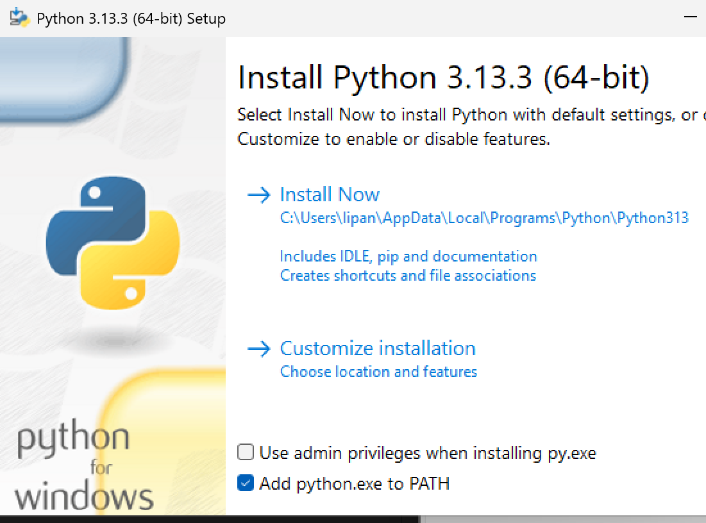
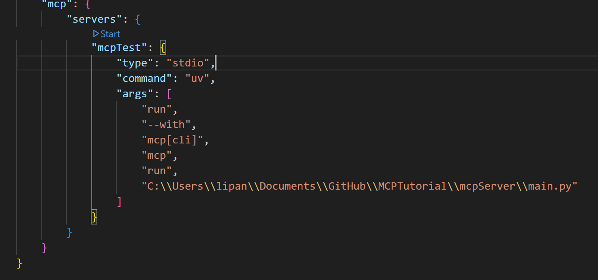
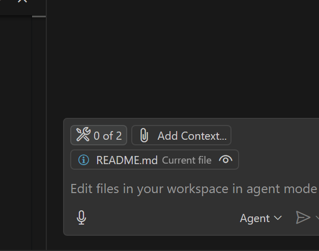
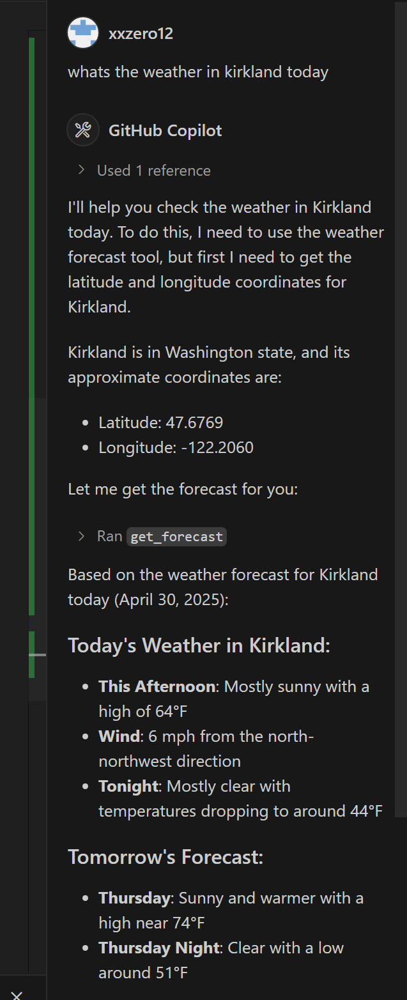
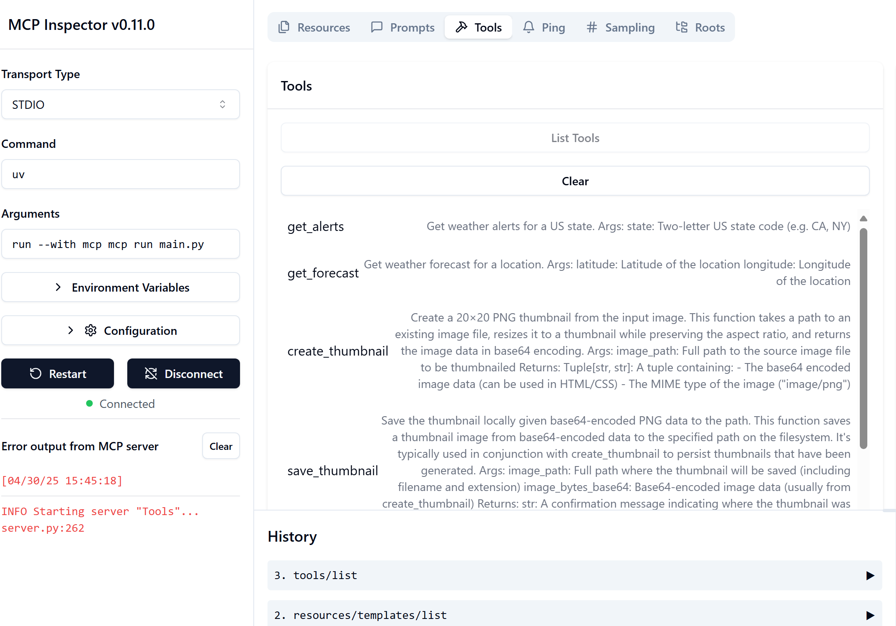
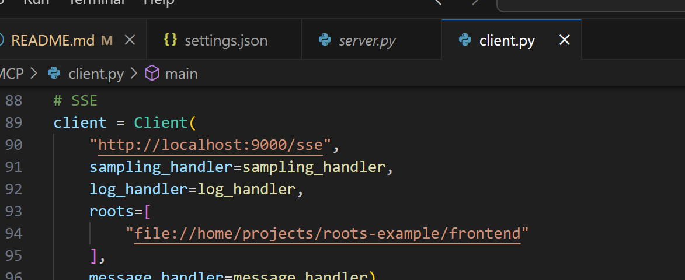
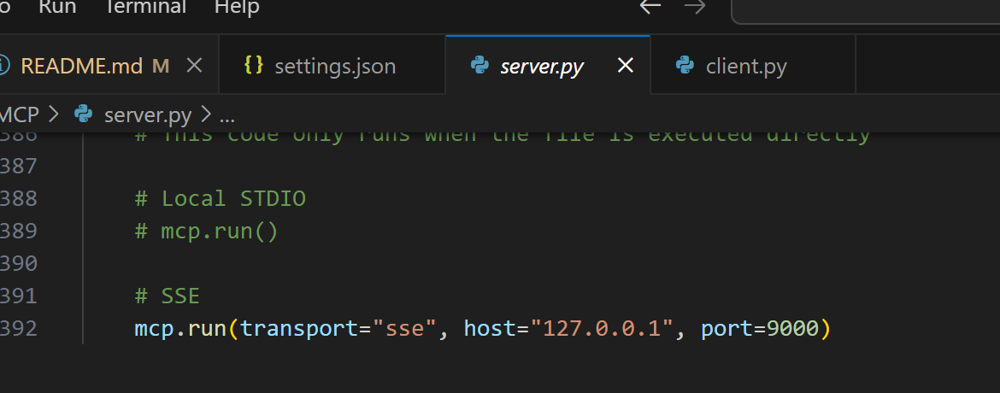
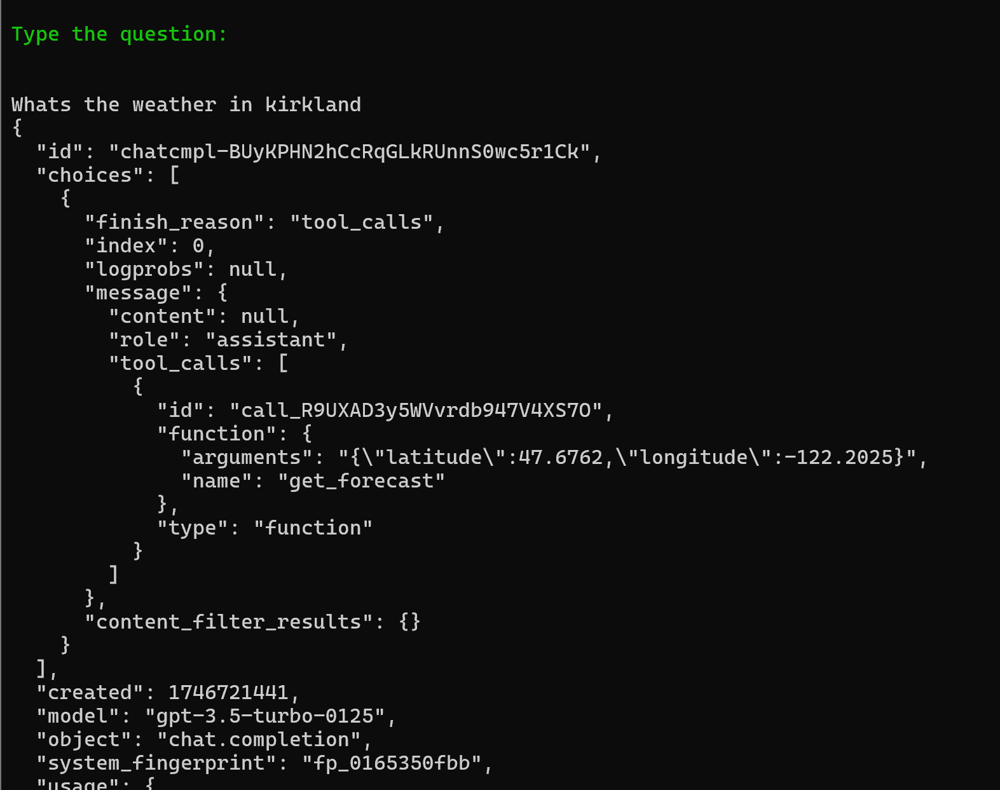

# MCPTutorial
### Prerequisite

Please clone the repo on local

##### 1. Install python >= 3.10
Select add python to path


Then restart vscode

##### 2. Install python >= 3.10
run in vscode terminal
```
powershell -ExecutionPolicy ByPass -c "irm https://astral.sh/uv/install.ps1 | iex"
```
restart vscode

##### 3. Run python environment
Run below commands inside the MCP folder
```
# Create virtual environment and activate it
uv venv
.venv\Scripts\activate

# if you encounter error like activate.ps1 cannot be      
loaded because running scripts is disabled on this system. For more information, see about_Execution_Policies, run below command
Set-ExecutionPolicy -Scope CurrentUser -ExecutionPolicy RemoteSigned

# Install dependencies
uv add mcp[cli] httpx Pillow fastmcp openai azure.identity

# You may need to update to latest MCP version
uv pip install --upgrade fastmcp

# You can run the server stand alone in terminal by below command
uv run python server.py
```


##### 4. Set up MCP server
Open user setting by ctrl + shift + P


Paste below to replace
Change the filepath to the local absolute path for the main.py
type open user setting json and paste below
For local, change the server.py code in main
```
mcp.run()
```
then change the open user setting to below
```
{
    "mcp": {
        "servers": {
            "mcpTest": {
                "type": "stdio",
                "command": "uv",
                "args": [
                    "run",
                    "--with",
                    "mcp[cli]",
                    "--with",
                    "pillow",
                    "--with",
                    "fastmcp",
                    "mcp",
                    "run",
                    "C:\\Users\\lipan\\Documents\\GitHub\\MCPTutorial\\MCP\\server.py"
                ]
            }
        }
    }
}
```
For SSE
change server code in server.py on main to
```
mcp.run(transport="sse", host="127.0.0.1", port=9000)
```

and change open user setting to below
```
{
    "mcp": {
        "servers": {
            "mcpTest": {
                "type": "sse",
                "url": "http://localhost:9000/sse"
            }
        }
    }
}
```

##### 4. Run MCP server
click start and it will start running


sign in github copilot and select claude 3.7

click tool in vscode agent and select tools



You can ask something like
```
whats the weather in kirkland today
```



To debug mcp server
Run below command
```
uv run mcp dev main.py
# if you see the error, npx not found. Please ensure Node.js and npm are properly installed and added to your system PATH.
# then you need to install the latest nodejs https://nodejs.org/en/download
```



##### 5. Run MCP client
To run the MCP Client
Please make sure you are added in the security group(is adding all people currently)
Then type below command to log into azure first
```
az account set --subscription "fe105136-f441-4214-8a12-1d1f4955e15f"
az login 
then press enter to continue
```

Need to change below for different protocol testing in client.py
```
# Create MCP client

# Local STDIO
client = Client(
    "server.py", 
    sampling_handler=sampling_handler, 
    log_handler=log_handler,
    roots=[
        "file://home/projects/roots-example/frontend"
    ],
    message_handler=message_handler)

# SSE
client = Client(
    "http://localhost:9000/sse", 
    sampling_handler=sampling_handler, 
    log_handler=log_handler,
    roots=[
        "file://home/projects/roots-example/frontend"
    ],
    message_handler=message_handler)
```

Then run the 
```
uv run python client.py
```


To run the demo
You will need 
# 1 Set SSE Mode
Set both client and server in SSE mode
client

server


Then run server first
```
uv run python server.py
```
# 2 Two client mode
You can run below for interactive chat mode and see the message exchanged(make sure to be added in the openai group to get api call permission, I added all people in the chat, but ping lipan if see unauthorized)
```
uv run python client.py chat 
```



or you can comment out one section by one section and see whats the demo in the code
```
uv run python client.py 
```

